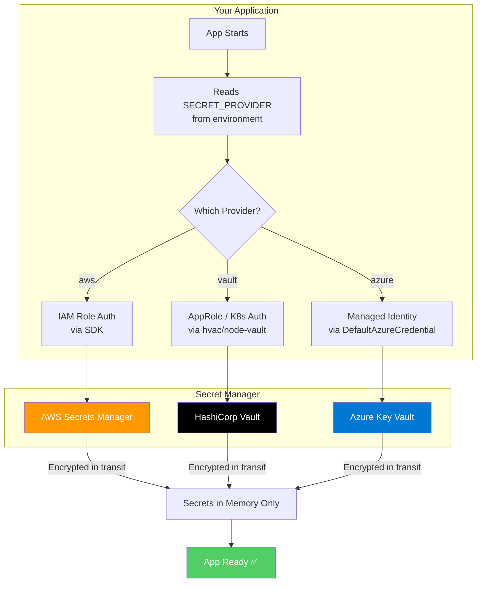
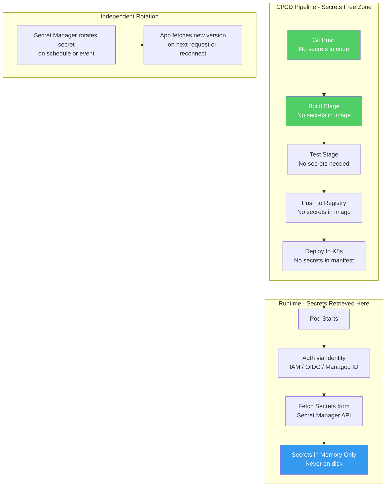
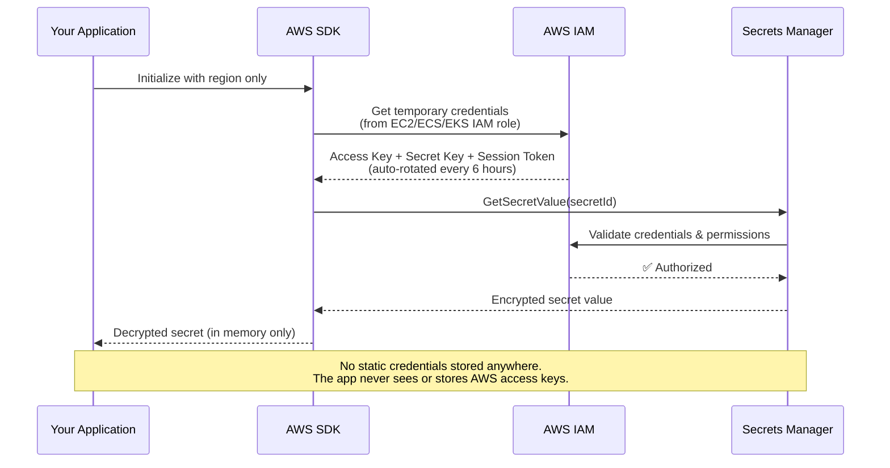
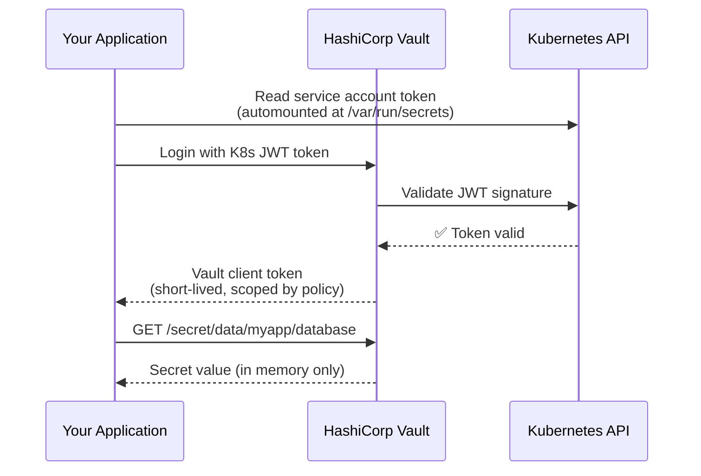
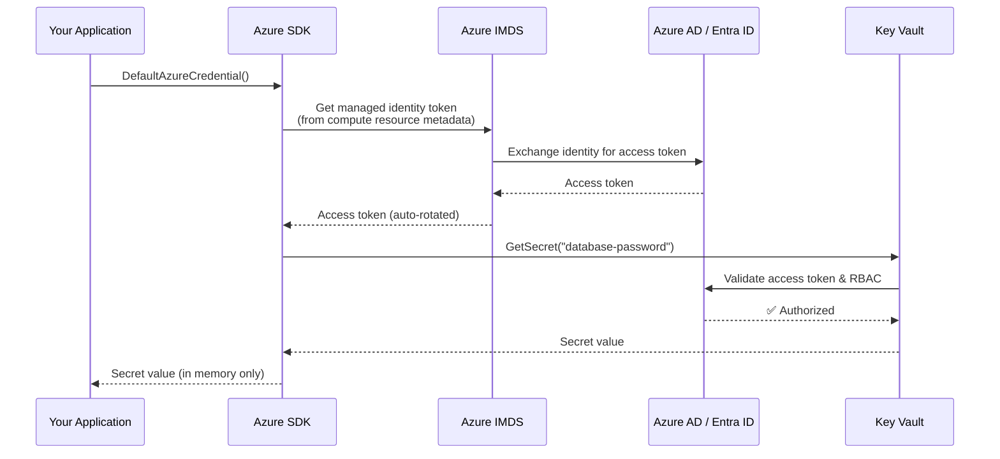

<p align="center">
  
  
  
  
</p>

<p align="center">
  
  
  
  
  
</p>

<p align="center">
  
  
  
</p>

<h1 align="center">🔐 Secrets Management Tutorial</h1>

<p align="center">
  A production-grade, developer-friendly guide to securely storing and retrieving application secrets using<br/>
  <strong>AWS Secrets Manager</strong> · <strong>HashiCorp Vault</strong> · <strong>Azure Key Vault</strong>
</p>

<p align="center">
  <a href="#-introduction">Introduction</a> ·
  <a href="#-why-env-files-are-risky">Why .env Fails</a> ·
  <a href="#-what-is-secrets-management">Secrets Management</a> ·
  <a href="#-architecture">Architecture</a> ·
  <a href="#-quick-start">Quick Start</a> ·
  <a href="#-comparison">Comparison</a> ·
  <a href="#-best-practices">Best Practices</a>
</p>

---

## 📖 Introduction

Every application needs secrets — database passwords, API keys, JWT signing keys, encryption certificates. The way you store, distribute, and rotate these secrets directly determines your application's security posture. A single leaked credential can lead to data breaches, unauthorized access, regulatory fines, and reputational damage that takes years to recover from.

This repository is a **complete, hands-on tutorial** that teaches developers how to move beyond insecure `.env` files and implement proper secrets management using the three leading enterprise platforms: **AWS Secrets Manager**, **HashiCorp Vault**, and **Azure Key Vault**. Each concept is demonstrated with **working Python, Node.js, and FastAPI code** that you can run today, with Docker and Kubernetes deployments ready for production.

Whether you're a junior developer writing your first API or a senior engineer hardening a microservices architecture, this repository provides the patterns, code, and infrastructure you need to handle secrets the right way — from development through production.

### What You'll Learn

- **Why** `.env` files and hardcoded credentials are a security risk
- **How** to authenticate with secret managers using identity-based access (IAM, OIDC, managed identities)
- **How** to fetch secrets dynamically at runtime without ever writing them to disk
- **How** to implement secret rotation so compromised credentials are automatically replaced
- **How** to deploy secret-aware applications in Docker and Kubernetes
- **How** to integrate with real-world services: OpenAI, PostgreSQL, JWT authentication
- **What** common mistakes developers make and how to avoid every single one

---

## ⚠️ Why .env Files Are Risky

The `.env` file is the most common way developers handle secrets — and `.env` files become dangerous when used outside isolated local development. Because `.env` is not a security strategy. Here's a breakdown of the specific risks that make `.env` files unsuitable for any environment beyond local development:

### The Risk Chain

```mermaid
flowchart LR
    A[Developer writes<br/>.env file] -->|commits| B[Git Repository]
    B -->|pushes| C[GitHub/GitLab]
    C -->|cloned by| D[CI/CD Pipeline]
    D -->|builds| E[Docker Image<br/>with secrets baked in]
    E -->|pushes| F[Container Registry]
    F -->|deploys| G[Production Server]

    style A fill:#ff6b6b,color:#fff
    style B fill:#ff6b6b,color:#fff
    style C fill:#ff6b6b,color:#fff
    style E fill:#ff6b6b,color:#fff
    style F fill:#ff6b6b,color:#fff
```



### Specific Risks Explained

| Risk | Impact | Real-World Example |
|------|--------|-------------------|
| **Committed to Git** | Anyone with repo access (now or in the future) can read secrets | Uber's 2022 breach started with a compromised GitHub token |
| **Baked into Docker images** | `docker history` or image layer inspection exposes secrets | Countless AWS keys found on Docker Hub via `docker pull` + `docker inspect` |
| **Stored in container registries** | Every image version retains all secrets from build time | A developer's old image tag still contains the original DB password |
| **No rotation support** | Changing a secret requires rebuilding and redeploying | When a key is compromised, every deployed instance remains vulnerable until manual redeploy |
| **No audit trail** | You cannot know who accessed which secret and when | Compliance frameworks (SOC 2, PCI-DSS) require secret access auditing |
| **Plaintext storage** | `.env` files are unencrypted text on disk | A server compromise means instant access to all application secrets |
| **Accidental exposure** | `.env` files are commonly included in deployments, logs, and screenshots | TruffleHog and GitLeaks scan millions of repos and find secrets in 20%+ of public repos |

> **Bottom line:** `.env` files are acceptable **only** for local development with a properly configured `.gitignore`. They must **never** be committed, baked into images, or deployed to any shared environment.

> 📖 For the full visual analysis, see [`architecture/01-traditional-env-approach.md`](architecture/01-traditional-env-approach.md)

---

## 🏗️ What Is Secrets Management?

**Secrets management** is the practice of securely storing, distributing, and rotating sensitive configuration data (secrets) throughout the application lifecycle. A proper secrets management system provides:

### Core Capabilities

- **Encrypted Storage** — Secrets are encrypted at rest using hardware-backed key management (AWS KMS, Azure Key Vault HSM, Vault's seal key)
- **Identity-Based Access** — Applications authenticate using their identity (IAM roles, service accounts, managed identities) rather than static credentials
- **Dynamic Secret Generation** — Some systems (Vault) can generate temporary credentials on-demand with automatic expiration
- **Automatic Rotation** — Secrets can be rotated on a schedule or in response to events, with zero application downtime
- **Audit Logging** — Every secret access is logged with timestamp, identity, and action for compliance and forensics
- **Version History** — Previous versions of secrets are retained for rollback, with access controlled by policy
- **Centralized Management** — All secrets across all environments are managed from a single control plane

### How It Works: The Runtime Retrieval Pattern

Instead of embedding secrets in code or config files, applications fetch them **at startup** (or on-demand) from a secrets manager using an identity-based authentication flow. The secrets exist only in memory and are never written to disk.



> 📖 For the full architecture diagrams, see [`architecture/02-secure-runtime-retrieval.md`](architecture/02-secure-runtime-retrieval.md)

---

## 📐 Architecture

This repository includes five detailed architecture diagrams that illustrate the complete secrets management lifecycle:

| Diagram | File | What It Shows |
|---------|------|---------------|
| Traditional .env Risks | [`architecture/01-traditional-env-approach.md`](architecture/01-traditional-env-approach.md) | How secrets leak through git, CI/CD, Docker, and registries |
| Secure Runtime Retrieval | [`architecture/02-secure-runtime-retrieval.md`](architecture/02-secure-runtime-retrieval.md) | Three parallel flows (AWS/Vault/Azure) with identity-based auth |
| CI/CD Integration | [`architecture/03-cicd-integration.md`](architecture/03-cicd-integration.md) | How to keep secrets completely outside the CI/CD pipeline |
| Kubernetes Secret Injection | [`architecture/04-kubernetes-secret-injection.md`](architecture/04-kubernetes-secret-injection.md) | Vault Agent Injector, External Secrets Operator, and IRSA side by side |
| Secret Rotation | [`architecture/05-secret-rotation.md`](architecture/05-secret-rotation.md) | Automatic rotation lifecycle and graceful application handling |

### CI/CD Integration Flow

A critical principle of secrets management is that **secrets must never pass through your CI/CD pipeline**. The pipeline builds and deploys secret-free artifacts, and the deployed application fetches secrets at runtime:



> 📖 See [`architecture/03-cicd-integration.md`](architecture/03-cicd-integration.md) for the complete diagram

---

## 🚀 Quick Start

### Prerequisites

Choose **one** secret provider to start with based on your cloud platform:

| Provider | Prerequisites | Setup Time |
|----------|---------------|------------|
| **AWS Secrets Manager** | AWS account, AWS CLI, IAM credentials | ~5 minutes |
| **HashiCorp Vault** | Docker (dev mode) or Vault server | ~5 minutes |
| **Azure Key Vault** | Azure account, Azure CLI, subscription | ~5 minutes |

### Step 1: Clone the Repository

```bash
git clone https://github.com/rksharma-owg/secrets-management-tutorial.git
cd secrets-management-tutorial
```

### Step 2: Choose Your Provider and Set Up

<details>
<summary><strong>🟠 Option A: AWS Secrets Manager</strong></summary>

```bash
# Install AWS CLI if you haven't already
pip install awscli

# Configure AWS credentials (use IAM roles in production, not static keys)
aws configure

# Create a secret
aws secretsmanager create-secret \
  --name myapp/database \
  --description "Production database credentials" \
  --secret-string '{"username":"admin","password":"SuperSecret123!","host":"db.example.com","port":5432,"dbname":"myapp"}'

# Create an OpenAI API key secret
aws secretsmanager create-secret \
  --name myapp/openai \
  --description "OpenAI API configuration" \
  --secret-string '{"api_key":"sk-proj-your-key-here","model":"gpt-4","organization":"org-your-org"}'

# Create a JWT configuration secret
aws secretsmanager create-secret \
  --name myapp/jwt \
  --description "JWT signing configuration" \
  --secret-string '{"secret_key":"your-256-bit-secret","algorithm":"HS256","expiry_hours":24}'
```

See the full guide: [`aws-secrets-manager/README.md`](aws-secrets-manager/README.md)

</details>

<details>
<summary><strong>🟡 Option B: HashiCorp Vault (Dev Mode)</strong></summary>

```bash
# Start Vault in dev mode (for learning only — NOT for production)
docker run -d --name vault-dev -p 8200:8200 -e 'VAULT_DEV_ROOT_TOKEN_ID=dev-only-token' vault:1.15

# Enable KV v2 secrets engine
docker exec vault-dev vault secrets enable -path=secret kv-v2

# Write a secret
docker exec vault-dev vault kv put secret/myapp/database \
  username=admin password=SuperSecret123! host=db.example.com port=5432 dbname=myapp

docker exec vault-dev vault kv put secret/myapp/openai \
  api_key=sk-proj-your-key-here model=gpt-4 organization=org-your-org

docker exec vault-dev vault kv put secret/myapp/jwt \
  secret_key=your-256-bit-secret algorithm=HS256 expiry_hours=24
```

See the full guide: [`hashicorp-vault/README.md`](hashicorp-vault/README.md)

</details>

<details>
<summary><strong>🔵 Option C: Azure Key Vault</strong></summary>

```bash
# Install Azure CLI
pip install azure-cli

# Log in
az login

# Create a resource group and Key Vault
az group create --name myapp-rg --location eastus
az keyvault create --name myapp-vault-12345 --resource-group myapp-rg --location eastus

# Set secrets (use --value in production scripts, not hardcoded)
az keyvault secret set --vault-name myapp-vault-12345 --name database-username --value "admin"
az keyvault secret set --vault-name myapp-vault-12345 --name database-password --value "SuperSecret123!"
az keyvault secret set --vault-name myapp-vault-12345 --name openai-api-key --value "sk-proj-your-key-here"
az keyvault secret set --vault-name myapp-vault-12345 --name jwt-secret-key --value "your-256-bit-secret"
```

See the full guide: [`azure-key-vault/README.md`](azure-key-vault/README.md)

</details>

### Step 3: Configure Environment Variables

```bash
# Copy the example environment file
cp docker/.env.example .env

# Edit it with your provider configuration
# IMPORTANT: This file contains NO actual secrets — only endpoints and identifiers
```

Your `.env` file should contain **only** configuration endpoints, **never** the secrets themselves:

```env
SECRET_PROVIDER=aws          # or: vault, azure
AWS_REGION=us-east-1         # AWS region (no access keys needed with IAM roles)
VAULT_ADDR=http://localhost:8200
AZURE_VAULT_URL=https://myapp-vault-12345.vault.azure.net/
LOG_LEVEL=INFO
```

### Step 4: Run the Examples

<details>
<summary><strong>🐍 Python Examples</strong></summary>

```bash
# Install dependencies
pip install -r requirements.txt

# Run AWS Secrets Manager example
SECRET_PROVIDER=aws AWS_REGION=us-east-1 python examples/python/aws_secrets.py

# Run Vault example
SECRET_PROVIDER=vault VAULT_ADDR=http://localhost:8200 VAULT_TOKEN=dev-only-token python examples/python/vault_secrets.py

# Run Azure Key Vault example
SECRET_PROVIDER=azure AZURE_VAULT_URL=https://myapp-vault-12345.vault.azure.net/ python examples/python/azure_secrets.py

# Run the factory pattern (automatically selects provider based on SECRET_PROVIDER)
python examples/python/secret_manager_factory.py
```

</details>

<details>
<summary><strong>🟢 Node.js Examples</strong></summary>

```bash
# Install dependencies
npm install

# Run AWS example
SECRET_PROVIDER=aws AWS_REGION=us-east-1 node examples/nodejs/aws-secrets.js

# Run Vault example
SECRET_PROVIDER=vault VAULT_ADDR=http://localhost:8200 VAULT_TOKEN=dev-only-token node examples/nodejs/vault-secrets.js

# Run Azure example
SECRET_PROVIDER=azure AZURE_VAULT_URL=https://myapp-vault-12345.vault.azure.net/ node examples/nodejs/azure-secrets.js

# Run the factory pattern
node examples/nodejs/secret-manager-factory.js

# Start the Express server
node examples/nodejs/server.js
```

</details>

<details>
<summary><strong>⚡ FastAPI Example</strong></summary>

```bash
# Install dependencies
pip install -r requirements.txt

# Run with AWS
SECRET_PROVIDER=aws AWS_REGION=us-east-1 uvicorn examples.fastapi.app:app --reload

# Run with Vault
SECRET_PROVIDER=vault VAULT_ADDR=http://localhost:8200 VAULT_TOKEN=dev-only-token uvicorn examples.fastapi.app:app --reload

# Run with Azure
SECRET_PROVIDER=azure AZURE_VAULT_URL=https://myapp-vault-12345.vault.azure.net/ uvicorn examples.fastapi.app:app --reload
```

The FastAPI app includes:
- `GET /health` — Health check (no secrets exposed)
- `GET /config` — Non-sensitive configuration overview
- `POST /db-test` — Tests database connectivity using secrets
- `POST /ai/chat` — Demonstrates OpenAI integration using secrets from the secret manager
- JWT-authenticated endpoints using signing keys from the secret manager

</details>

### Step 5: Run with Docker Compose

```bash
cd docker

# Start all services (Vault in dev mode + PostgreSQL + Python app + Node.js app)
docker compose up --build

# Vault will be available at http://localhost:8200
# Python app at http://localhost:8000
# Node.js app at http://localhost:3000
```

> **Note:** The Docker Compose setup uses Vault dev mode for learning. See the `docker/docker-compose.yml` comments for production alternatives.

### Step 6: Deploy to Kubernetes

```bash
cd kubernetes

# 1. Install Vault (via Helm — see 01-vault-install.yaml for reference)
helm repo add hashicorp https://helm.releases.hashicorp.com
helm install vault hashicorp/vault -f 01-vault-install.yaml

# 2. Deploy with Vault Agent Injector
kubectl apply -f 02-vault-agent-injector.yaml

# 3. Deploy with External Secrets Operator
kubectl apply -f 03-external-secrets-operator.yaml

# 4. Deploy with IRSA for AWS
kubectl apply -f 04-irsa-aws-secrets.yaml

# See kubernetes/README.md for detailed instructions
```

---

## 🔐 Authentication Flow Explanation

Each secrets manager uses a different authentication mechanism, but they all follow the same principle: **authenticate with identity, not with credentials**.

### AWS Secrets Manager — IAM Authentication



**Key Point:** On EC2, ECS, or EKS, you assign an **IAM role** to the compute resource. The AWS SDK automatically obtains temporary credentials from the instance metadata service — your application code never touches an access key.

### HashiCorp Vault — AppRole / Kubernetes Auth



**Key Point:** Vault integrates with Kubernetes service accounts. The pod's identity is its Kubernetes service account, and Vault maps that to a policy that controls which secrets the pod can access.

### Azure Key Vault — Managed Identity



**Key Point:** Azure Managed Identities assign an identity to your compute resource (VM, App Service, AKS pod). The `DefaultAzureCredential` class automatically discovers and uses this identity — no credentials in code or configuration.

---

## 🔑 Runtime Secret Fetching Examples

### Python — Fetch and Use a Database Secret

```python
import os
import structlog
from examples.python.aws_secrets import AWSSecretsManager

logger = structlog.get_logger()

# Initialize with environment-variable bootstrapping only (no hardcoded credentials)
manager = AWSSecretsManager(region=os.environ["AWS_REGION"])

# Fetch database credentials at runtime
db_creds = manager.get_database_credentials("myapp/database")
# Returns: {"username": "admin", "password": "***", "host": "db.example.com", ...}

# Use in your application (secrets exist only in memory)
engine = create_async_engine(
    f"postgresql+asyncpg://{db_creds['username']}:{db_creds['password']}"
    f"@{db_creds['host']}:{db_creds['port']}/{db_creds['dbname']}"
)

logger.info("Database connection established",
            host=db_creds["host"],
            database=db_creds["dbname"])
# NOTE: password is NEVER logged — only non-sensitive fields
```

### Node.js — Fetch and Use an OpenAI Secret

```javascript
import { getOpenaiConfig } from './aws-secrets.js';
import OpenAI from 'openai';

// Fetch OpenAI configuration at runtime
const config = await getOpenaiConfig('myapp/openai');
// Returns: { apiKey: 'sk-proj-...', model: 'gpt-4', organization: 'org-...' }

// Use the secret (exists only in process memory)
const openai = new OpenAI({
  apiKey: config.apiKey,
  organization: config.organization,
});

const response = await openai.chat.completions.create({
  model: config.model,
  messages: [{ role: 'user', content: 'Hello!' }],
});
```

### FastAPI — Application Startup Secret Loading

```python
from contextlib import asynccontextmanager
from fastapi import FastAPI
from examples.python.secret_manager_factory import get_secret_manager

@asynccontextmanager
async def lifespan(app: FastAPI):
    """Load all secrets at startup — fail fast if secrets are unavailable."""
    manager = get_secret_manager()  # Factory selects based on SECRET_PROVIDER env var
    app.state.secrets = {
        "database": await manager.get_database_credentials("myapp/database"),
        "jwt": await manager.get_jwt_config("myapp/jwt"),
        "openai": await manager.get_openai_config("myapp/openai"),
    }
    logger.info("All secrets loaded successfully")
    yield  # Application runs here
    # Cleanup on shutdown
    logger.info("Application shutting down")

app = FastAPI(lifespan=lifespan)
```

### Secret Rotation Concept

Secrets can be rotated without restarting your application. The pattern is:

1. The secret manager rotates the secret (new version created)
2. Your application detects the change (version number, connection error, or polling)
3. Your application fetches the new secret version
4. Connections are re-established with the new credentials

```python
async def check_and_rotate_credentials(self, secret_name: str) -> dict:
    """Check if a secret has been rotated and fetch the latest version."""
    current_version = self._version_cache.get(secret_name)

    # Fetch metadata to check current version
    metadata = await self._get_secret_version(secret_name)

    if metadata["version"] != current_version:
        logger.info("Secret rotation detected",
                    secret=secret_name,
                    old_version=current_version,
                    new_version=metadata["version"])
        new_secret = await self.get_secret(secret_name)
        self._version_cache[secret_name] = metadata["version"]
        return new_secret

    return self._secret_cache[secret_name]
```

---

## 📊 Comparison: AWS Secrets Manager vs HashiCorp Vault vs Azure Key Vault

| Feature | AWS Secrets Manager | HashiCorp Vault | Azure Key Vault |
|---------|-------------------|-----------------|-----------------|
| **Hosting** | Fully managed (AWS) | Self-hosted or HCP Cloud | Fully managed (Azure) |
| **Free Tier** | 30 days free, then $0.40/secret/month | Open source (free to self-host) | 20,000 operations/month free |
| **Dynamic Secrets** | RDS/IAM/Redshift credentials | Database, AWS, GCP, Azure, PKI, SSH | Certificates, keys only |
| **Automatic Rotation** | Built-in (with Lambda) | Built-in (configurable) | Certificate auto-renewal only |
| **Secret Types** | Key-value, binary, credentials | KV, dynamic, transit (encryption-as-service), PKI | Keys, secrets, certificates, storage |
| **Encryption** | AWS KMS (AES-256) | Shamir's Secret Sharing + AES-256 | Azure HSM (RSA 2048+, AES-256) |
| **Access Control** | IAM policies | Vault policies (HCL) + namespaces | Azure RBAC or Access Policies |
| **Audit Logging** | CloudTrail | Built-in audit device | Azure Monitor / Activity Log |
| **Kubernetes Integration** | IRSA + ESO | Agent Injector, CSI Provider, ESO | ESO + Azure Workload Identity |
| **Multi-Cloud** | AWS only | Any cloud or on-premises | Azure only |
| **Learning Curve** | Low | Medium-High | Low-Medium |
| **Best For** | AWS-native applications | Multi-cloud, on-prem, complex secret needs | Azure-native applications |
| **Community** | AWS docs, community forums | Large open-source community, tutorials | Microsoft docs, Q&A forums |

### When to Use Which?

- **Choose AWS Secrets Manager** if your entire stack runs on AWS and you want the simplest managed solution with built-in rotation for RDS and IAM credentials.

- **Choose HashiCorp Vault** if you need multi-cloud support, dynamic secret generation (temporary database credentials that auto-expire), encryption-as-a-service, or run workloads across multiple cloud providers and on-premises environments.

- **Choose Azure Key Vault** if your stack is primarily on Azure and you need integrated certificate management, secure key storage, or tight integration with Azure services like App Service and AKS.

---

## ❌ Common Mistakes Developers Make With Secrets

Based on real-world security incidents and penetration testing findings, here are the most common — and most dangerous — mistakes developers make when handling secrets:

### 1. Committing `.env` Files to Git

This is the single most common secrets leak vector. Even with `.gitignore`, it happens through force-adds, renamed files, or pre-commit hook failures. Tools like **TruffleHog** and **GitLeaks** find secrets in 20%+ of public repositories.

**Fix:** Use a pre-commit hook that scans for secrets. Never use `git add -f` for config files. Use `git-secrets` or `detect-secrets` in your CI pipeline.

### 2. Hardcoding Credentials in Source Code

```python
# ❌ NEVER do this
DB_PASSWORD = "SuperSecret123!"
API_KEY = "sk-proj-abc123..."

# ✅ Do this instead
import os
db_password = secret_manager.get_secret("database/password")
```

Even if you remove the credential in the next commit, it remains in your git history forever. Anyone who clones or forks the repository can find it.

**Fix:** Secrets must come from environment variables or secret managers. Implement secret scanning in CI/CD.

### 3. Baking Secrets into Docker Images

```dockerfile
# ❌ NEVER do this
ENV DB_PASSWORD=SuperSecret123!
COPY .env /app/.env

# ✅ Do this instead
ENV SECRET_PROVIDER=aws
ENV AWS_REGION=us-east-1
# The app fetches secrets at runtime via IAM role
```

Docker images are immutable artifacts. Every version of the image contains every secret that was present at build time. `docker history` can expose build arguments and environment variables.

**Fix:** Pass only configuration endpoints (not secrets) as environment variables. Use runtime secret fetching.

### 4. Storing Secrets in CI/CD Variables Without Rotation

Most CI/CD platforms (GitHub Actions, GitLab CI, Jenkins) support encrypted variables. However, these are often set once and never rotated, creating a single point of failure.

**Fix:** Rotate CI/CD secrets regularly. Prefer OIDC federation (GitHub Actions → AWS/GCP/Azure) over long-lived CI/CD tokens.

### 5. Using the Same Secret Across Environments

Using the same database password for development, staging, and production means a dev environment compromise is a production compromise.

**Fix:** Use separate secrets per environment. Store them in separate secret manager paths (`dev/myapp/database`, `prod/myapp/database`).

### 6. Logging Secret Values

```python
# ❌ NEVER do this
logger.info(f"Connecting to database with password: {password}")

# ✅ Do this instead
logger.info("Connecting to database",
            host=db_host,
            database=db_name)
# The password is never logged
```

Secrets in logs end up in log aggregation systems (ELK, Datadog, CloudWatch) where more people have access than you intended.

**Fix:** Use structured logging. Configure log redaction rules. Never include password, key, token, or secret fields in log output.

### 7. Sharing Secrets via Slack, Email, or Documents

Secrets shared via messaging platforms, emails, or documents persist indefinitely and can be accessed by anyone with access to those channels, including former employees.

**Fix:** Use a secrets manager with proper access controls. Share only the secret manager path or ARN, never the value itself.

### 8. Not Encrypting Secrets at Rest

Storing secrets in plaintext files, databases, or configuration stores without encryption means a server or disk compromise exposes all secrets.

**Fix:** All three providers in this tutorial encrypt secrets at rest by default. If you must store secrets locally, use encrypted storage (SOPS, age, or GPG).

### 9. Ignoring Secret Rotation

A secret that is never rotated is a secret that, once compromised, remains compromised indefinitely.

**Fix:** Implement automatic rotation. AWS Secrets Manager supports Lambda-based rotation. Vault supports configurable rotation. For Azure, use automation scripts or Azure Functions.

### 10. Over-Permissioning Service Accounts

Giving an application access to ALL secrets when it only needs ONE creates unnecessary blast radius. If the application is compromised, the attacker gets access to every secret in the vault.

**Fix:** Follow the principle of least privilege. Create narrow IAM policies, Vault policies, or Azure RBAC roles that grant access to only the specific secrets each application needs.

---

## ✅ Production Best Practices

### Application-Level Practices

1. **Fetch secrets at startup, not on every request.** Cache secrets in memory and refresh on rotation or connection failure. This reduces latency and secret manager API calls.

2. **Fail fast if secrets are unavailable.** If your application cannot retrieve a required secret at startup, it should crash immediately rather than running in a degraded state. Use health checks to signal unavailability.

3. **Use structured logging with redaction.** Configure your logging framework to automatically redact any field containing `password`, `secret`, `key`, `token`, or `credential`. Never log secret values, even in debug mode.

4. **Implement circuit breakers for secret manager calls.** If the secret manager is unavailable, your application should degrade gracefully (use cached values if available) rather than crashing or making blocking calls.

5. **Use the factory pattern for provider abstraction.** This repository demonstrates a `SecretManager` factory that lets you switch between AWS, Vault, and Azure by changing a single environment variable. This avoids vendor lock-in and simplifies testing.

### Infrastructure-Level Practices

6. **Use identity-based authentication everywhere.** On AWS, use IAM roles (not access keys). On Azure, use Managed Identities (not service principals). On Kubernetes, use service accounts bound to RBAC. Never use static, long-lived credentials.

7. **Enable audit logging.** Ensure every secret access is logged with the caller's identity, timestamp, and secret identifier. Review logs regularly for anomalous access patterns.

8. **Implement network-level controls.** Restrict secret manager access to specific VPCs, subnets, or IP ranges. Use VPC endpoints (AWS), private endpoints (Azure), or network policies (Kubernetes) to prevent unauthorized network access.

9. **Encrypt secrets at rest and in transit.** All three providers in this tutorial encrypt at rest by default. Ensure TLS is enforced for all API calls. Use certificate pinning in high-security environments.

10. **Separate secrets by environment and application.** Use a hierarchical naming scheme: `environment/application/service/secret-type`. This enables fine-grained access control and simplifies auditing.

### Kubernetes-Specific Practices

11. **Prefer External Secrets Operator or Vault Agent Injector** over native Kubernetes Secrets. Native secrets are only base64-encoded (not encrypted), lack rotation support, and have no audit logging.

12. **Use IRSA (AWS) or Workload Identity (Azure/GCP)** for pod-level identity. Never pass static cloud credentials as Kubernetes secrets or environment variables.

13. **Enable etcd encryption** if you must use native Kubernetes Secrets. This encrypts secrets at the storage level, but does not address access control or rotation limitations.

### CI/CD-Specific Practices

14. **Never store secrets in CI/CD configuration files.** Use the CI/CD platform's secret store (GitHub Actions Secrets, GitLab CI Variables) with OIDC federation to cloud providers when possible.

15. **Scan for secrets in every pipeline run.** Integrate TruffleHog, GitLeaks, or detect-secrets into your CI/CD pipeline to catch accidentally committed secrets before they reach the main branch.

16. **Rotate CI/CD secrets on a schedule.** Treat CI/CD secrets with the same rigor as production secrets. Set calendar reminders to rotate them at least quarterly.

---

## 🔗 Example Integrations

This repository demonstrates secret management for three common use cases:

### OpenAI / OpenRouter API Keys

Store your AI provider API keys in the secret manager and fetch them at runtime:

```python
# Secret stored in AWS Secrets Manager as "myapp/openai"
# {"api_key": "sk-proj-...", "model": "gpt-4", "organization": "org-..."}

config = await secret_manager.get_openai_config("myapp/openai")
openai_client = OpenAI(api_key=config["api_key"], organization=config["organization"])
```

See: [`examples/python/aws_secrets.py`](examples/python/aws_secrets.py) — `get_openai_config()` method
See: [`examples/nodejs/aws-secrets.js`](examples/nodejs/aws-secrets.js) — `getOpenaiConfig()` function
See: [`examples/fastapi/app.py`](examples/fastapi/app.py) — `/ai/chat` endpoint

### Database Credentials

Store database connection details and fetch them for connection pooling:

```python
# Secret stored as "myapp/database"
# {"username": "admin", "password": "...", "host": "db.example.com", "port": 5432, "dbname": "myapp"}

creds = await secret_manager.get_database_credentials("myapp/database")
engine = create_async_engine(f"postgresql+asyncpg://{creds['username']}:{creds['password']}@{creds['host']}:{creds['port']}/{creds['dbname']}")
```

See: [`examples/python/aws_secrets.py`](examples/python/aws_secrets.py) — `get_database_credentials()` method
See: [`examples/fastapi/database.py`](examples/fastapi/database.py) — `DatabaseManager` class with rotation support
See: [`examples/nodejs/config/database.js`](examples/nodejs/config/database.js) — `DatabasePool` class

### JWT Secrets

Store JWT signing keys and configuration:

```python
# Secret stored as "myapp/jwt"
# {"secret_key": "your-256-bit-secret", "algorithm": "HS256", "expiry_hours": 24}

jwt_config = await secret_manager.get_jwt_config("myapp/jwt")
token = jwt.encode({"sub": "user-123", "exp": time.time() + 86400},
                   jwt_config["secret_key"],
                   algorithm=jwt_config["algorithm"])
```

See: [`examples/fastapi/auth.py`](examples/fastapi/auth.py) — `JWTAuthManager` class with full token lifecycle
See: [`examples/nodejs/middleware/auth.js`](examples/nodejs/middleware/auth.js) — JWT middleware with algorithm pinning

---

## 📸 Screenshots

> The following screenshots demonstrate the workflow described in this tutorial. Replace these placeholders with your own screenshots after running the examples.

| Screenshot | Description |
|-----------|-------------|
|  | AWS Secrets Manager console showing stored secrets |
|  | HashiCorp Vault UI showing KV v2 secret paths |
|  | Azure Key Vault portal showing secret values |
|  | Python example output showing successful secret retrieval |
|  | Node.js example output with Express server running |
|  | FastAPI Swagger UI showing available endpoints |
|  | Docker Compose running all services |
|  | Kubernetes pods running with Vault Agent injection |

---

## 📁 Repository Structure

```
secrets-management-tutorial/
├── README.md                          # You are here — the main tutorial
├── .gitignore                         # Excludes .env, secrets, credentials, caches
├── requirements.txt                   # Python dependencies
├── package.json                       # Node.js dependencies
│
├── aws-secrets-manager/
│   └── README.md                      # AWS-specific setup guide, IAM policies, CLI commands
│
├── hashicorp-vault/
│   └── README.md                      # Vault-specific setup guide, policies, secret engines
│
├── azure-key-vault/
│   └── README.md                      # Azure-specific setup guide, RBAC, managed identities
│
├── examples/
│   ├── python/
│   │   ├── aws_secrets.py             # AWS Secrets Manager client (boto3)
│   │   ├── vault_secrets.py           # HashiCorp Vault client (hvac)
│   │   ├── azure_secrets.py           # Azure Key Vault client (azure-identity)
│   │   └── secret_manager_factory.py  # Factory pattern for provider abstraction
│   ├── nodejs/
│   │   ├── aws-secrets.js             # AWS Secrets Manager client (@aws-sdk)
│   │   ├── vault-secrets.js           # HashiCorp Vault client (node-vault)
│   │   ├── azure-secrets.js           # Azure Key Vault client (@azure/identity)
│   │   ├── secret-manager-factory.js  # Factory pattern for provider abstraction
│   │   ├── server.js                  # Express server with runtime secret fetching
│   │   ├── middleware/
│   │   │   └── auth.js                # JWT authentication middleware
│   │   └── config/
│   │       └── database.js            # Database pool with secret-based credentials
│   └── fastapi/
│       ├── app.py                     # FastAPI app with lifespan-based secret loading
│       ├── auth.py                    # JWT auth manager using secret manager
│       └── database.py                # Async SQLAlchemy with secret rotation
│
├── docker/
│   ├── Dockerfile.python              # Multi-stage Python Dockerfile (non-root user)
│   ├── Dockerfile.nodejs              # Multi-stage Node.js Dockerfile (non-root user)
│   ├── docker-compose.yml             # Full stack: Vault + PostgreSQL + Python + Node.js
│   └── .env.example                   # Example environment variables (NO actual secrets)
│
├── kubernetes/
│   ├── README.md                      # K8s deployment guide with comparison table
│   ├── 01-vault-install.yaml          # Vault installation reference (Helm-based)
│   ├── 02-vault-agent-injector.yaml   # Vault Agent sidecar injection example
│   ├── 03-external-secrets-operator.yaml  # ESO with AWS, Azure, and Vault stores
│   ├── 04-irsa-aws-secrets.yaml       # IAM Roles for Service Accounts (AWS EKS)
│   └── 05-native-k8s-secrets.yaml     # Native K8s secrets (with production caveats)
│
├── architecture/
│   ├── 01-traditional-env-approach.md # Diagram: how .env files leak secrets
│   ├── 02-secure-runtime-retrieval.md # Diagram: secure secret fetching flow
│   ├── 03-cicd-integration.md         # Diagram: CI/CD without secrets
│   ├── 04-kubernetes-secret-injection.md  # Diagram: K8s secret injection patterns
│   └── 05-secret-rotation.md          # Diagram: secret rotation lifecycle
│
├── screenshots/                       # Screenshot placeholders (add your own)
│
└── scripts/                           # Utility scripts (contributions welcome)
```

---

## 🛡️ Security Best Practices Summary

| Practice | Why It Matters |
|----------|---------------|
| Never commit `.env` files | Git history is permanent and often public |
| Never hardcode credentials | Source code is shared, forked, and archived |
| Never bake secrets into images | Images are immutable and inspectable |
| Use identity-based auth | Eliminates static credentials entirely |
| Fetch secrets at runtime | Secrets exist only in memory, never on disk |
| Rotate secrets automatically | Limits the window of exploitation |
| Log access, never values | Enables auditing without creating new leak vectors |
| Follow least privilege | Minimizes blast radius of a compromise |
| Encrypt at rest and in transit | Protects against infrastructure-level breaches |
| Scan for secrets in CI/CD | Catches mistakes before they reach production |

---

## 🤝 Contributing

Contributions are welcome! This is an open educational resource. To contribute:

1. Fork the repository
2. Create a feature branch: `git checkout -b feature/your-feature`
3. Make your changes (ensure code is well-commented and educational)
4. Test your examples work with at least one secret provider
5. Commit with a descriptive message: `git commit -m "Add Terraform examples for Vault"`
6. Push and open a Pull Request

### Areas We'd Love Contributions

- Terraform / Pulumi IaC examples for provisioning secret managers
- Additional language examples (Go, Java, Rust)
- GitHub Actions / GitLab CI integration examples
- Advanced Vault use cases (Transit engine, PKI engine)
- Real-world case studies and lessons learned

---

## 📄 License

This repository is released under the [MIT License](LICENSE). Use it freely for learning, teaching, and production reference.

---

<p align="center">
  <strong>Built for developers who know hardcoded secrets become breach reports.</strong>
  <br/><br/>
  
</p>