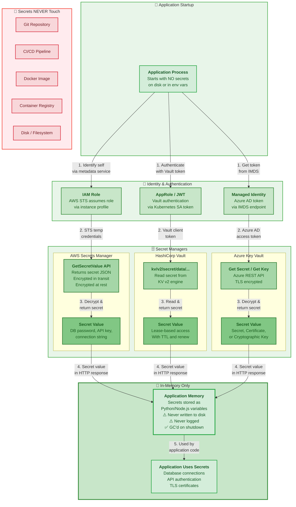

# Architecture: Secure Runtime Secret Retrieval

> **Recommended approach:** Secrets are never stored in code, images, or CI/CD. They are retrieved at runtime from a dedicated secret manager.

## Diagram



## How Secure Runtime Retrieval Works

### Step 1: Identity & Authentication

Instead of storing static credentials, the application **proves its identity** to the secret manager. This is done through the cloud platform's identity system:

- **AWS:** The EC2 instance or EKS pod assumes an IAM role via the instance metadata service. Temporary STS credentials are automatically rotated.
- **HashiCorp Vault:** The Kubernetes Service Account token (JWT) is exchanged for a Vault token via the Kubernetes auth method. Tokens have a TTL and can be renewed.
- **Azure:** The managed identity assigned to the VM or App Service retrieves an Azure AD token from the Instance Metadata Service (IMDS).

### Step 2: Secret Retrieval

Using the authenticated identity, the application makes an API call to retrieve the secret:

- All communication is over **TLS (HTTPS)**
- Secrets are **encrypted at rest** in the secret manager
- Access is logged by the secret manager's **audit trail**
- The API call includes the **minimum permissions** needed (principle of least privilege)

### Step 3: In-Memory Storage

The secret value is loaded directly into the application's memory:

- **Never written to disk** - no `.env` file, no temp file, no swap (ideally)
- **Never committed to git** - the code references a secret ID/name, not the value
- **Never baked into Docker images** - the image is identical across all environments
- **Never visible in CI/CD** - pipelines build images without any secrets

### Step 4: Graceful Shutdown

When the application shuts down or is restarted:

- In-memory secrets are **garbage collected** with the process
- No secrets remain on the filesystem
- New instances retrieve fresh secrets on startup
- If rotation occurred, the new instance automatically gets the latest version

## Key Security Properties

| Property | Traditional .env | Runtime Retrieval |
|----------|-----------------|-------------------|
| Secrets in git? | ❌ Yes | ✅ No (only secret names) |
| Secrets in CI/CD? | ❌ Yes | ✅ No |
| Secrets in Docker image? | ❌ Yes (baked in) | ✅ No (image is clean) |
| Secrets in registry? | ❌ Yes | ✅ No |
| Secrets on disk? | ❌ Yes (.env file) | ✅ No (in-memory only) |
| Rotation support? | ❌ Manual redeploy | ✅ Automatic / on-demand |
| Audit trail? | ❌ None | ✅ Full API logging |
| Access control? | ❌ Everyone with repo | ✅ IAM policies / Vault policies |
| Revocation? | ❌ Impossible | ✅ Instant (revoke IAM/policy) |

## What Changes in Your Code

The application code changes are minimal. Instead of reading from environment variables or `.env` files, you call the secret manager API at startup:

```python
# Before (insecure - reads from .env)
import os
db_password = os.environ["DB_PASSWORD"]

# After (secure - retrieves from secret manager at runtime)
import boto3
client = boto3.client("secretsmanager")
secret = client.get_secret_value(SecretId="prod/db/password")
db_password = secret["SecretString"]
```

The key insight is that **the code references a secret by name/ID, not by value**. The actual secret value only exists in the secret manager and in the application's memory at runtime.

## Next Steps

- [03-cicd-integration.md](./03-cicd-integration.md) - How this fits into CI/CD pipelines
- [04-kubernetes-secret-injection.md](./04-kubernetes-secret-injection.md) - Kubernetes-specific patterns
- [05-secret-rotation.md](./05-secret-rotation.md) - How secret rotation works