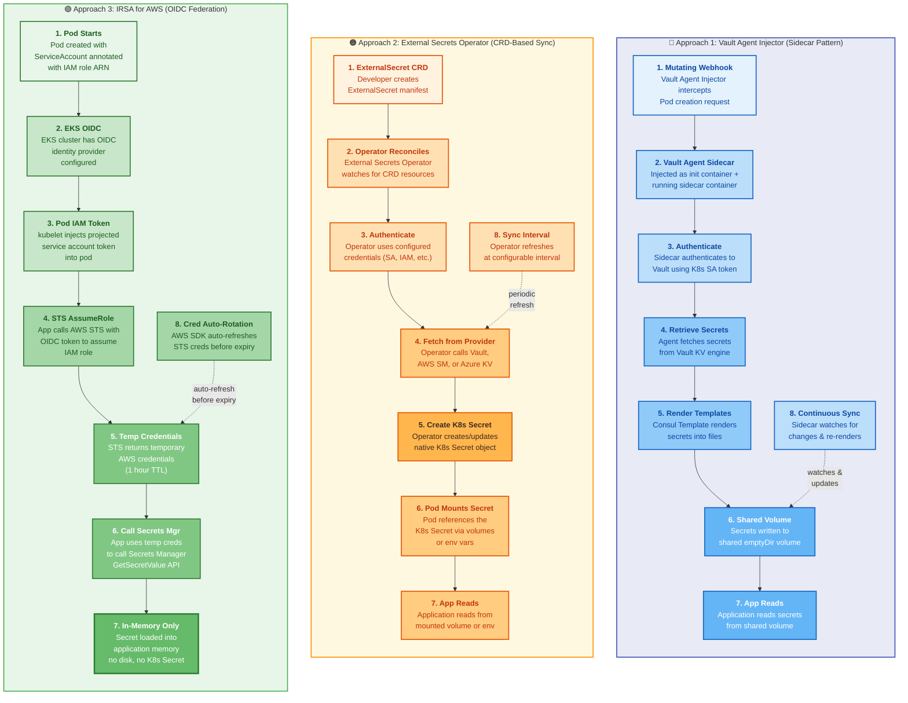

# Architecture: Kubernetes Secret Injection Patterns

> Three production-ready approaches for injecting secrets into Kubernetes Pods, each with different tradeoffs.

## Diagram



## Approach Comparison

| Feature | Vault Agent Injector | External Secrets Operator | IRSA (AWS) |
|---------|---------------------|--------------------------|------------|
| **Provider** | HashiCorp Vault | Multi-provider | AWS Only |
| **Secret Location** | Shared emptyDir volume | K8s Secret object | Application memory |
| **Sidecar Needed?** | Yes (Vault Agent) | No (cluster-wide operator) | No |
| **Secret on Disk?** | Yes (emptyDir, RAM-backed) | Yes (etcd, encrypted) | No |
| **Rotation** | Continuous (sidecar watches) | Periodic (configurable interval) | On fetch |
| **Setup Complexity** | Medium | Medium | Low (if on EKS) |
| **Multi-Cloud?** | Yes | Yes | No |
| **Native K8s Integration** | Medium (mutation webhook) | High (CRDs) | High (IAM roles for SA) |
| **Zero-Trust?** | Yes (Vault policies) | Medium (depends on provider) | Yes (IAM policies) |

---

## Approach 1: Vault Agent Injector (Sidecar Pattern)

### How It Works

The Vault Agent Injector is a Kubernetes **Mutating Admission Webhook** that automatically:

1. **Intercepts** Pod creation requests that have specific Vault annotations
2. **Injects** a Vault Agent sidecar container alongside your application container
3. **Injects** a shared `emptyDir` volume (can be backed by `memory` medium)
4. The sidecar **authenticates** to Vault using the pod's Kubernetes ServiceAccount token
5. The sidecar **retrieves** secrets from Vault's KV engine
6. **Consul Template** renders the secrets into configuration files on the shared volume
7. The sidecar **continuously watches** for secret changes and re-renders

### Key Configuration

```yaml
apiVersion: apps/v1
kind: Deployment
spec:
  template:
    metadata:
      annotations:
        vault.hashicorp.com/agent-inject: "true"
        vault.hashicorp.com/role: "my-app"
        vault.hashicorp.com/secret-volume-path: "/vault/secrets"
        vault.hashicorp.com/agent-inject-secret-config: "secret/data/my-app/config"
        vault.hashicorp.com/agent-inject-template-config: |
          {{- with secret "secret/data/my-app/config" -}}
          DATABASE_URL={{ .Data.data.db_url }}
          {{- end }}
    spec:
      serviceAccountName: my-app-sa
      containers:
        - name: my-app
          volumeMounts:
            - name: vault-secrets
              mountPath: /vault/secrets
      volumes:
        - name: vault-secrets
          emptyDir:
            medium: Memory  # RAM-backed, never hits disk
```

### Pros
- **Continuous sync** - secrets updated automatically without pod restart
- **Template rendering** - transform secrets into any config format
- **Fine-grained access** - Vault policies per application
- **Multi-cloud** - works with any Kubernetes cluster

### Cons
- **Sidecar overhead** - extra container per pod (CPU/memory)
- **EmptyDir on disk** unless you use `medium: Memory`
- **Vault dependency** - requires running Vault infrastructure

---

## Approach 2: External Secrets Operator (CRD-Based Sync)

### How It Works

The External Secrets Operator (ESO) is a **Kubernetes operator** that:

1. **Watches** for `ExternalSecret` custom resources
2. **Authenticates** to the external secret provider using configured credentials
3. **Fetches** secrets from the provider (Vault, AWS SM, Azure KV, GCP SM, etc.)
4. **Creates or updates** a native Kubernetes `Secret` object
5. **Periodically refreshes** at a configurable interval (default: 1m)

### Key Configuration

```yaml
apiVersion: external-secrets.io/v1beta1
kind: ExternalSecret
metadata:
  name: my-app-secrets
spec:
  refreshInterval: 15m
  secretStoreRef:
    name: aws-secrets-store
    kind: ClusterSecretStore
  target:
    name: my-app-secrets
    creationPolicy: Owner
  data:
    - secretKey: db_password
      remoteRef:
        key: prod/db/password
    - secretKey: api_key
      remoteRef:
        key: prod/api/key
---
apiVersion: apps/v1
kind: Deployment
spec:
  template:
    spec:
      containers:
        - name: my-app
          env:
            - name: DB_PASSWORD
              valueFrom:
                secretKeyRef:
                  name: my-app-secrets
                  key: db_password
```

### Pros
- **Native Kubernetes UX** - uses CRDs, works with existing Secret references
- **Multi-provider** - Vault, AWS, Azure, GCP, 1Password, CyberArk, etc.
- **No sidecar** - single operator for the whole cluster
- **Familiar pattern** - secrets end up as K8s Secrets that pods already know how to use

### Cons
- **Secrets in etcd** - K8s Secrets are stored in etcd (should be encrypted at rest)
- **Periodic sync** - not real-time (configurable interval)
- **Operator dependency** - another operator to maintain in the cluster
- **Blast radius** - anyone with `get secret` permission can read secrets

---

## Approach 3: IRSA for AWS (OIDC Federation)

### How It Works

IAM Roles for Service Accounts (IRSA) uses **OIDC federation** to map Kubernetes ServiceAccounts to AWS IAM roles:

1. **EKS cluster** is configured with an OIDC identity provider (using AWS IAM OpenID Connect)
2. **IAM role** has a trust policy that allows the K8s ServiceAccount to assume it
3. **ServiceAccount** is annotated with the IAM role ARN
4. **kubelet** injects a projected ServiceAccount token (OIDC JWT) into the pod
5. **AWS SDK** automatically discovers the token and calls STS `AssumeRoleWithWebIdentity`
6. **STS** returns temporary AWS credentials (1-hour TTL, auto-refreshed)
7. **Application** uses the credentials to call Secrets Manager directly
8. **Secrets loaded into memory** - never touch disk or K8s etcd

### Key Configuration

```yaml
# IAM Trust Policy
{
  "Version": "2012-10-17",
  "Statement": [{
    "Effect": "Allow",
    "Principal": {
      "Federated": "arn:aws:iam::111122223333:oidc-provider/oidc.eks.us-east-1.amazonaws.com/id/EXAMPLED539D4633E53DE1B716D3041E"
    },
    "Action": "sts:AssumeRoleWithWebIdentity",
    "Condition": {
      "StringEquals": {
        "oidc.eks.us-east-1.amazonaws.com/id/EXAMPLED539D4633E53DE1B716D3041E:sub": "system:serviceaccount:default:my-app-sa",
        "oidc.eks.us-east-1.amazonaws.com/id/EXAMPLED539D4633E53DE1B716D3041E:aud": "sts.amazonaws.com"
      }
    }
  }]
}
```

```yaml
# Kubernetes ServiceAccount
apiVersion: v1
kind: ServiceAccount
metadata:
  name: my-app-sa
  namespace: default
  annotations:
    eks.amazonaws.com/role-arn: arn:aws:iam::111122223333:role/my-app-role
```

### Pros
- **No secrets on disk** - pure in-memory, the most secure option
- **No sidecar** - no additional containers or operators needed
- **Automatic credential rotation** - AWS SDK handles STS token refresh
- **Fine-grained IAM** - per-pod IAM policies
- **Simplest to implement** on EKS

### Cons
- **AWS-only** - requires EKS (or self-managed K8s with OIDC setup)
- **Application code changes** - app must call AWS SDK directly
- **No secret rendering** - raw secret values returned, app must parse them
- **Cold start delay** - STS assume role adds ~100-200ms to startup

---

## Which Approach Should You Choose?

| Scenario | Recommended Approach |
|----------|---------------------|
| Running on EKS with AWS-only secrets | **IRSA** - simplest, most secure |
| Multi-cloud or hybrid environment | **External Secrets Operator** - provider-agnostic |
| Already using Vault enterprise features | **Vault Agent Injector** - full Vault feature set |
| Need dynamic database credentials | **Vault Agent Injector** - Vault's database engine |
| Want simplest migration from K8s Secrets | **External Secrets Operator** - same UX |
| Maximum security (zero disk) | **IRSA** or **Vault with memory-backed emptyDir** |
| Need secret rendering/templates | **Vault Agent Injector** - Consul Template |

## Next Steps

- [05-secret-rotation.md](./05-secret-rotation.md) - How rotation works with each approach
- [../hashicorp-vault/README.md](../hashicorp-vault/README.md) - Vault setup guide
- [../aws-secrets-manager/README.md](../aws-secrets-manager/README.md) - AWS Secrets Manager guide