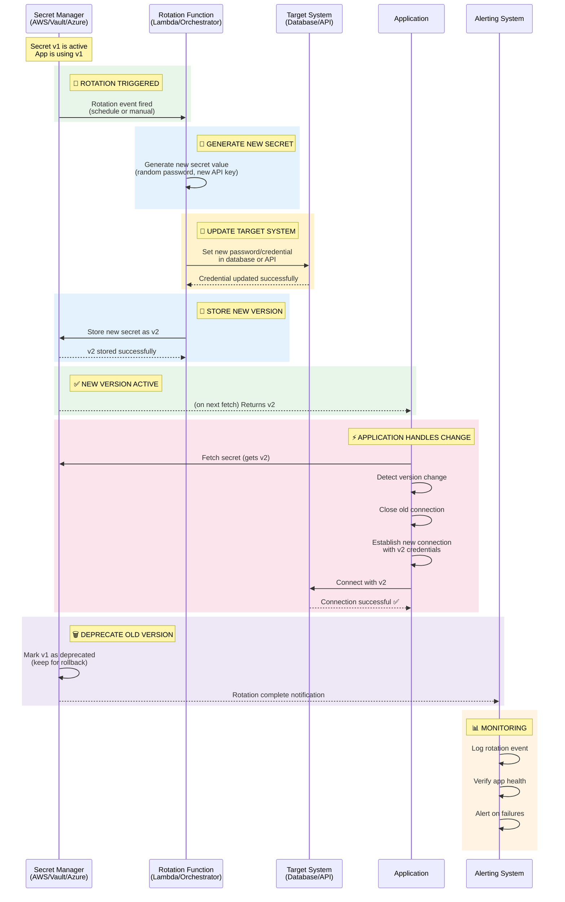
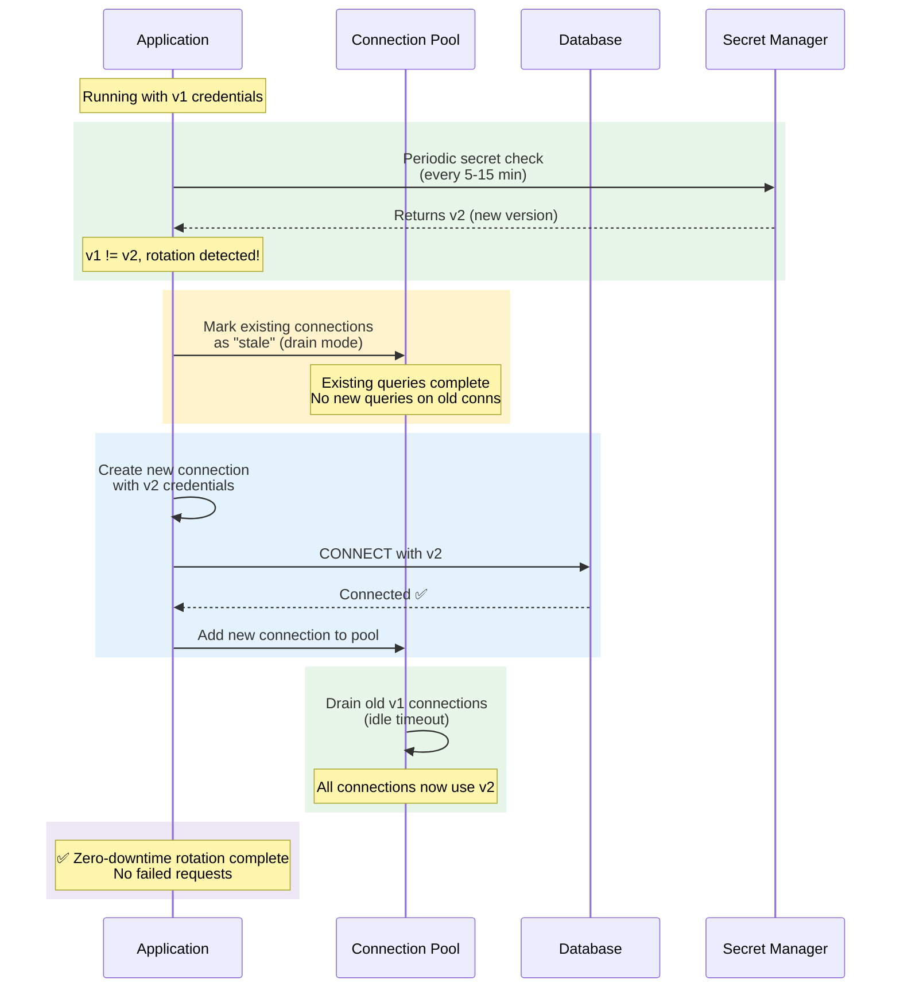

# Architecture: Secret Rotation Lifecycle

> Secret rotation is the process of replacing an existing secret with a new one, ensuring applications can transition seamlessly without downtime.

## Diagram: Automatic Rotation Flow



## Diagram: Application Graceful Rotation Handling



## Rotation Strategies

### 1. Automatic Rotation (AWS Secrets Manager)

AWS Secrets Manager has **built-in rotation** using Lambda functions:

- Schedule: Every 30 days (configurable, 1-365 days)
- The Lambda function generates a new password, updates the database, and stores the new version
- Applications using `GetSecretValue` automatically get the latest version
- **No application restart needed** if the app polls for secret changes

```json
// Rotation schedule configuration
{
  "AutomaticRotationAfterDays": 30,
  "RotationLambdaARN": "arn:aws:lambda:us-east-1:123456789012:function:rotate-db-password",
  "RotationEnabled": true
}
```

### 2. Dynamic Credentials (HashiCorp Vault)

Vault goes beyond rotation - it **generates unique, short-lived credentials** for each request:

- **Database Engine:** Each app instance gets a unique DB username/password with a 1-hour TTL
- **AWS Engine:** Each app instance gets unique STS credentials with a 15-minute TTL
- **Transit Engine:** Encrypt/decrypt operations use Vault-managed encryption keys
- When the TTL expires, the credential **automatically becomes invalid** - no deprecation needed

```hcl
# Vault policy for dynamic DB credentials
path "database/creds/my-app-role" {
  capabilities = ["read"]
  # Returns a unique username/password with 1h TTL
}
```

### 3. Manual Rotation (All Providers)

For secrets that cannot be auto-rotated (third-party API keys, certificates):

1. **Generate** new secret value
2. **Update** the third-party service with the new value
3. **Store** the new value in the secret manager as a new version
4. **Verify** applications pick up the new value
5. **Revoke** the old secret value at the third-party service
6. **Monitor** for any failures

### 4. Scheduled Rotation (Azure Key Vault)

Azure Key Vault supports rotation policies for certificates:

- Rotation is triggered by a **time-based schedule**
- A rotation **policy** defines the action to take (renew, notify, etc.)
- **Event Grid** can notify applications of rotation events
- Secrets have versioning - applications can pin to a version or use latest

## Application Implementation Patterns

### Pattern 1: Polling (Simple)

The application periodically checks for secret changes:

```python
import time, hashlib

def poll_for_rotation(secret_id, interval_seconds=300):
    last_hash = None
    while True:
        secret = get_secret(secret_id)
        current_hash = hashlib.sha256(secret.encode()).digest()
        if last_hash and current_hash != last_hash:
            rotate_connections(secret)
        last_hash = current_hash
        time.sleep(interval_seconds)
```

**Pros:** Simple to implement, works everywhere
**Cons:** Up to `interval_seconds` delay before detecting rotation

### Pattern 2: Event-Driven (Advanced)

The application listens for rotation events:

```python
# AWS SNS/SQS notification on secret rotation
def handle_rotation_event(event):
    secret_id = event["SecretId"]
    new_secret = get_secret(secret_id)
    rotate_connections(new_secret)
```

**Pros:** Near-instant rotation, no polling overhead
**Cons:** Requires event infrastructure (SNS, SQS, Event Grid)

### Pattern 3: Connection Pool Refresh (Database)

Database connections need special handling during rotation:

```python
def rotate_db_connection(new_password):
    # 1. Mark existing pool connections as stale
    pool.drain()

    # 2. Create a test connection with new credentials
    try:
        test_conn = create_connection(password=new_password, timeout=5)
        test_conn.close()
    except Exception:
        alert("Rotation failed - new credentials invalid!")
        return  # Old connections remain active

    # 3. Update pool config with new credentials
    pool.update_config(password=new_password)

    # 4. New connections will use new credentials
    # 5. Old connections will be closed on next checkout
```

**Key principles:**
- **Never hard-fail** on rotation detection - keep serving requests with old credentials
- **Test new credentials** before draining old connections
- **Drain gradually** - let in-flight requests complete
- **Alert on failure** - if new credentials don't work, investigate immediately

## Rotation Safety Checklist

- [ ] Rotation function has **minimal permissions** (only the secrets it rotates)
- [ ] **Rollback plan** exists (keep old version for at least one rotation period)
- [ ] Application **gracefully handles** credential changes (connection refresh)
- [ ] **Monitoring** alerts on rotation failures
- [ ] Rotation is **tested** in staging before production
- [ ] **Dead letter queue** captures failed rotation events
- [ ] Rotation **schedule is documented** and follows compliance requirements
- [ ] **Third-party services** are updated before secret manager (to avoid lockout)

## Next Steps

- [../aws-secrets-manager/README.md](../aws-secrets-manager/README.md) - AWS rotation setup
- [../hashicorp-vault/README.md](../hashicorp-vault/README.md) - Vault dynamic credentials
- [../azure-key-vault/README.md](../azure-key-vault/README.md) - Azure rotation policies